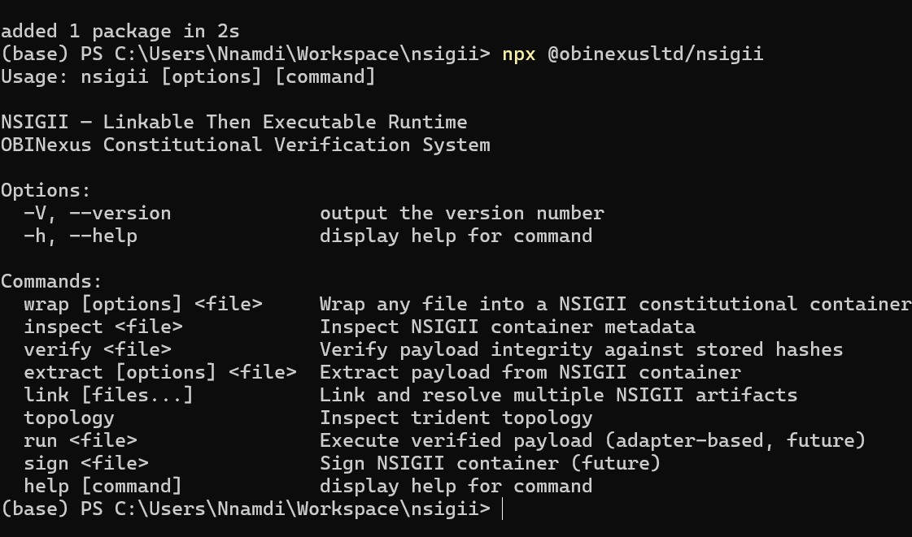

# nsigii

> **NSIGII — Linkable-Then-Executable Constitutional Verification Container Runtime**
>
> OBINexus Constitutional Computing Framework
>
> Container runtime for the NSIGII protocol. See [`docs/NSIGII-SPEC.md`](docs/NSIGII-SPEC.md)
> for the protocol specification; section references below (§) point into it.

---

## Two `.nsigii` formats

The extension and the `NSIGII` magic are shared by two unrelated layouts. Tell
them apart by **byte 7**:

| | byte 7 | Layout | Tooling |
|---|---|---|---|
| **Constitutional wrapper** | `0x07` (version_major) | 7-byte magic `NSIGII\0`, trident header, `ENDNSIGII` footer | `wrap` / `inspect` / `verify` / `extract`; viewer shows its verified receipt |
| **Codec stream** | `0x00` (magic padding) | 8-byte magic `NSIGII\0\0`, 32-byte header, raw DEFLATE frames | `inspect` / `verify` / `view`; [`examples/`](examples/README.md) render its frames |

The rest of this README documents the **wrapper**. The codec stream — a data
file whose interactivity is baked in as state — is documented under
[`examples/`](examples/README.md). `run` is intentionally verification-only:
NSIGII artifacts are data, so the CLI never executes their payloads.

---

## Installation


### Global (recommended)

```bash
npm install -g nsigii
```

Verify:

```bash
nsigii --help
```

### Local Development

```bash
git clone https://github.com/obinexusmk2/nsigii
cd nsigii
npm install
npm run build
npm link
nsigii --help
```

---

## Quick Start

```bash
# Create a sample file
echo "hello world" > hello.txt

# Wrap it into a NSIGII container
nsigii wrap hello.txt

# Inspect the container
nsigii inspect hello.txt.nsigii

# Verify integrity
nsigii verify hello.txt.nsigii

# Extract the payload
nsigii extract hello.txt.nsigii
```

### Expected Output
```
NSIGII v7.0.0
────────────────────────────
File ID:      <uuid>
Created:      2026-05-12T20:20:00.000Z
Original:     hello.txt
Format Hint:  text
Payload Size: 12 bytes
Payload Hash: a591a6d40bf420404a011733cfb7b190d62c65bf0bcda32b57b277d9ad9f146e
Consensus:    YES
Classification: SIGNAL
RWX Chain:    CH0 WRITE → CH1 READ → CH2 EXECUTE
Channels:
  CH0 TRANSMIT (SIGNAL)
  CH1 RECEIVE (SIGNAL)
  CH2 VERIFY (SIGNAL)
Final Hash:   <sha256>
```

---

## CLI Reference

```
NSIGII — Linkable Then Executable Runtime
OBINexus Constitutional Verification System

Usage:
  nsigii <command> [options]

Commands:
  wrap <file>       Wrap file into NSIGII container
  inspect <file>    Inspect NSIGII metadata
  verify <file>     Verify payload integrity
  extract <file>    Extract payload
  link              Resolve linked artifacts
  topology          Inspect trident topology
  run               Verify a data-only artifact; never execute a payload
  view              Validate and identify the independent browser viewer
  sign              Sign NSIGII container

Options:
  -v, --version
  -h, --help
```

---

## Architecture

NSIGII is **not** a traditional archive format.

It is a **constitutional verification wrapper** around arbitrary binary payloads.

### Flow

```
raw bytes
    ↓
linked container
    ↓
trinary verification
    ↓
optional execution
```

### Core Principles

1. **Type Container Principle**
   > "The bowl does not care what it holds."
   The container validates geometry and verification first, not semantic type. Payloads are arbitrary bytes.

2. **Trident Channel Model**
   Three constitutional channels form the verification lifecycle:
   - **TRANSMIT** — source intent
   - **RECEIVE** — observed payload
   - **VERIFY** — proof of agreement

3. **RWX Constitutional Chain**
   WRITE → READ → EXECUTE
   Execution never occurs before verification.

4. **Format Agnostic Execution**
   The wrapper never assumes meaning first. It verifies first. Interpretation is optional and secondary.

5. **Filter-Flash Model**
   - **Filter**: pure transformation, no global state mutation
   - **Flash**: commit verified data into storage

6. **Bipartite Electromagnetic Model**
   - Electric = runtime
   - Magnetic = structure
   - EM wave = interoperability

7. **Trinary Consensus**
   - YES / NO / MAYBE
   - SIGNAL / NOSIGNAL / NOISE / NONOISE

8. **Linkable-Then-Executable**
   raw bytes → linked container → verified state → optional execution

---

## NSIGII File Format

All multi-byte integers are little-endian (`endian` byte `0`). Hashes are stored
as lowercase SHA-256 hex (64 ASCII bytes), not raw digest bytes.

### Binary Layout

```
.nsigii container
├── Global File Header   369 bytes    starts with magic "NSIGII\0" then version_major 0x07
├── Channel Table          3 entries  222 bytes for the default TRANSMIT/RECEIVE/VERIFY roles
├── Segment Table          3 entries  303 bytes (101 bytes/entry) — the trident (§3.1)
├── Verification Block   213 bytes    trident hashes + consensus verdict (§3.6, §5.1)
├── Payload              raw bytes    the wrapped file, unmodified
└── Footer               145 bytes    "ENDNSIGII" + segment_count + final hash
```

Table lengths are not fixed: the header carries `header_size`, and
`channel_table_offset` / `segment_table_offset` / `payload_offset` locate every
following block, so a reader never assumes the sizes above. The file always ends
with the ASCII marker **`ENDNSIGII`** (9 bytes) — this is the terminating
sentinel a third party scans for to confirm the container was written in full.

### Header Fields

| Field | Offset | Size | Description |
|-------|-------:|-----:|-------------|
| magic | 0 | 7 | `NSIGII\0` |
| version_major | 7 | 1 | `7` (`0x07`) |
| version_minor | 8 | 1 | `0` |
| version_patch | 9 | 1 | `0` |
| format_type | 10 | 1 | `0` unknown, `1` archive … `7` mixed |
| endian | 11 | 1 | `0` = little-endian |
| header_size | 12 | 4 | total header bytes (`369` for v7.0.0) |
| payload_size | 16 | 8 | payload length in bytes |
| channel_count | 24 | 1 | `3` (the trident) |
| channel_table_offset | 25 | 8 | pointer to the channel table |
| segment_table_offset | 33 | 8 | pointer to the segment table |
| payload_offset | 41 | 8 | pointer to the payload |
| payload_hash | 49 | 64 | SHA-256 of the payload, hex |
| file_id | 113 | 64 | UUID |
| created_at | 177 | 32 | ISO-8601 timestamp |
| original_filename | 209 | 128 | name restored on `extract` |
| format_hint | 337 | 32 | textual format hint |

### Channels — the trident (§5.1)

| ID | Role | Wire verb | RWX tag (§4.2, POSIX) |
|----|------|-----------|-----------------------|
| CH0 | TRANSMIT | encodes + hashes the payload | WRITE — `0b010` = 2 |
| CH1 | RECEIVE | decodes the wire form | READ — `0b100` = 4 |
| CH2 | VERIFY | brokers consensus, emits the verdict | EXECUTE — `0b001` = 1 |

`verify` recomputes the payload hash and the channel-table hash, rebuilds the
final hash, and checks the RWX chain reads `WRITE → READ → EXECUTE`. A wrapper
reaches `YES` only when all three independent channel readings agree (`3/3`),
with its recorded verification receipt and final hash intact.

This is the package's strict wrapper-conformance profile. The wider protocol
documents discuss quorum behaviour for distributed receivers; this local,
single-artifact verifier deliberately does not promote a partial receipt to
`YES`.

### States

```
Classification:  NOISE(0x00) | NONOISE(0x01) | SIGNAL(0x02) | NOSIGNAL(0x03)   (§6.1 signal quadrants)
Consensus:       NO(0x00) | MAYBE(0x10) | YES(0xFF)                            (§5.4 yes / no / maybe)
Human-rights tag: NONE | TRANSMIT | RECEIVE | VERIFY | ARCHIVE | EVIDENCE      (§11.2)
```

### Footer

| Field | Size | Description |
|-------|-----:|-------------|
| magic | 9 | `ENDNSIGII` |
| segment_count | 8 | number of trident segments (`3`) |
| final_hash | 64 | SHA-256 of `payload ‖ channel_table_hash`, hex |
| signature | 64 | reserved for Ed25519 (§ roadmap); zero-filled today |

Containers written by pre-0.1 builds ended with the 8-byte marker `ENDSIGII`;
`inspect` / `verify` still read those, but every new container is written with
`ENDNSIGII`.

---

## SDK API

```typescript
import { wrapFile, inspectFile, verifyFile, extractFile } from "nsigii";

// Wrap → writes "document.pdf.nsigii", returns its path
const outPath = wrapFile("document.pdf");

// Inspect
const meta = inspectFile("document.pdf.nsigii");
console.log(meta.header.payloadHash);
console.log(meta.footer.finalHash);

// Verify
const result = verifyFile("document.pdf.nsigii");
// result.consensus → "YES" | "NO" | "MAYBE"

// Extract
const extracted = extractFile("document.pdf.nsigii");
```

---

## Philosophy

> **Linkable Then Executable**
>
> Physical design first. Technology next.
> When systems fail, build your own.

NSIGII treats every input as raw bytes first, links it, verifies it, and only then optionally interprets it. This is constitutional computing: verification is not an afterthought — it is the foundation.

**Do not** present this as blockchain, crypto hype, or AI hype.

Present it as:
- Protocol engineering
- Verification runtime
- Distributed systems substrate
- Container verification framework

---

## Project Structure

```
nsigii/
├── package.json
├── tsconfig.json
├── vitest.config.ts
├── README.md
├── bin/
│   └── nsigii
├── src/
│   ├── index.ts          # Public SDK API
│   ├── cli.ts            # Commander CLI
│   ├── constants.ts      # Binary layout constants
│   ├── types.ts          # TypeScript interfaces
│   ├── format/
│   │   ├── header.ts
│   │   ├── channel.ts
│   │   ├── segment.ts
│   │   ├── verification.ts
│   │   └── footer.ts
│   ├── core/
│   │   ├── wrap.ts
│   │   ├── inspect.ts
│   │   ├── verify.ts
│   │   ├── extract.ts
│   │   └── link.ts
│   ├── utils/
│   │   ├── hash.ts
│   │   ├── bytes.ts
│   │   └── detectFormat.ts
│   ├── protocol/
│   │   ├── constants.ts
│   │   ├── enums.ts
│   │   ├── states.ts
│   │   └── channels.ts
│   ├── verification/
│   │   ├── consensus.ts
│   │   ├── trident.ts
│   │   ├── rwx.ts
│   │   └── signatures.ts
│   ├── linker/
│   │   ├── linker.ts
│   │   ├── resolver.ts
│   │   └── topology.ts
│   ├── runtime/
│   │   └── adapters/
│   │       ├── zip.ts
│   │       ├── wasm.ts
│   │       ├── binary.ts
│   │       ├── text.ts
│   │       └── unknown.ts
│   ├── recovery/
│   │   └── enzyme.ts
│   └── container/
│       ├── reader.ts
│       ├── writer.ts
│       ├── parser.ts
│       └── serializer.ts
├── test/
│   ├── wrap.test.ts
│   ├── inspect.test.ts
│   ├── verify.test.ts
│   ├── extract.test.ts
│   ├── footer.test.ts       # ENDNSIGII terminating marker
│   └── viewer.test.ts       # container is recognised by examples/nsigii-viewer.html
└── examples/
    ├── sample.txt
    ├── nsigii-viewer.html
    └── README.md
```

---

## Future Roadmap

- [ ] WASM runtime adapters
- [ ] Rust verification core (native bindings)
- [ ] Distributed relay nodes (trident consensus networking)
- [ ] libpolycall bridge (polyglot runtime)
- [ ] Cloudflare Worker runtime
- [ ] NSIGII streaming containers
- [ ] Ed25519 digital signatures
- [ ] Trinary consensus execution engine
- [ ] Human Rights Verifier v2

---

## License

MIT — OBINexus Computing

---

> *"Don't just boot systems. Boot truthful ones."*
